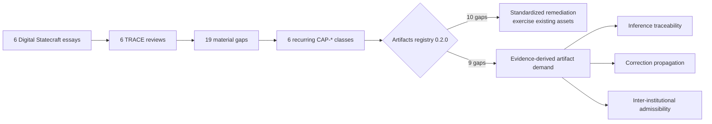
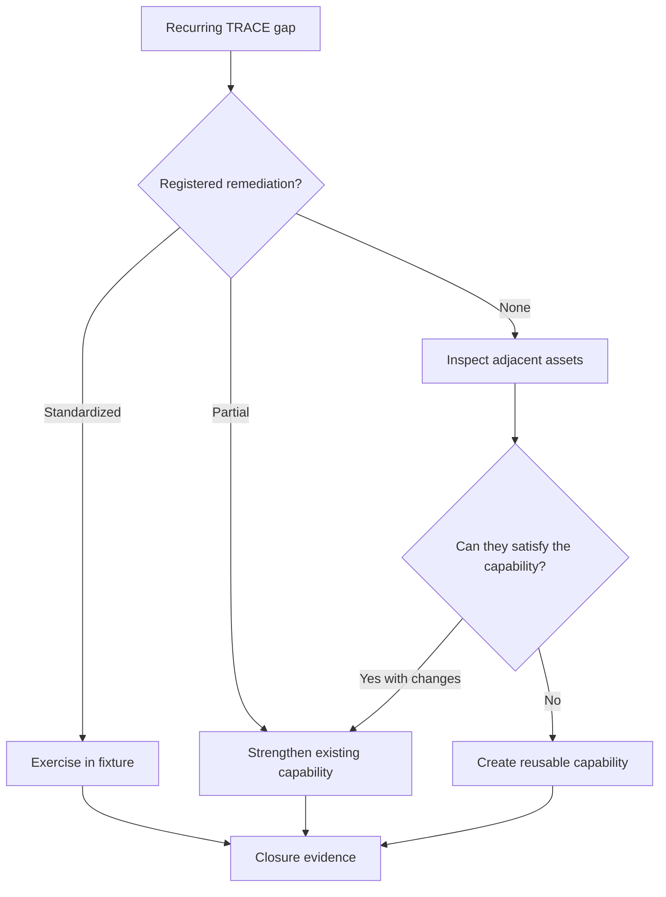

# Digital Statecraft DPI first-wave baseline

This is the corpus-level synthesis of six TRACE reviews. It is a historical baseline against `dpi-ai-governance-artifacts` remediation registry **0.2.0** at commit `3ea873bdb2ce719d82c86d459c9699ae6114b0d1`.

## Baseline metrics

| Measure | Result |
| --- | ---: |
| Publications evaluated | 6 |
| Material gaps | 19 |
| Recurring capability classes | 6 |
| Gaps with standardized remediation | 10 |
| Gaps with partial remediation | 0 |
| Gaps with no registered remediation | 9 |
| Artifact coverage | 52.63% |
| Standardized remediation coverage | 52.63% |
| Evidence-backed publication-gap closure | 0% |

The zero closure rate is expected: publication reviews do not contain deployment implementation evidence.

## Recurrence and remediation matrix

| Capability | Reviews | Gap count | Registry 0.2.0 coverage |
| --- | ---: | ---: | --- |
| `CAP-AUTHORITY-BOUNDED-DELEGATION` | 5/6 | 5 | Standardized |
| `CAP-INFERENCE-TRACEABILITY` | 4/6 | 4 | None / unregistered |
| `CAP-CORRECTION-PROPAGATION` | 3/6 | 3 | None / unregistered |
| `CAP-EVIDENCE-CLOSURE` | 3/6 | 3 | Standardized |
| `CAP-REDRESS-APPEAL` | 2/6 | 2 | Standardized |
| `CAP-INTERINSTITUTIONAL-ADMISSIBILITY` | 2/6 | 2 | None / unregistered |

## Cross-repository handoff

## Why the three unmet capabilities are real demand

### Inference traceability — 4/6 reviews

The corpus repeatedly distinguishes rules from automated transformations. Existing decision-receipt machinery binds rulebooks and input references but does not yet serialize the inference/model identity, immutable version, thresholds/parameters, output and permitted normative role needed to reconstruct probabilistic or AI-assisted decisions.

### Correction propagation — 3/6 reviews

Existing registry-correction request/response schemas cover correction at the source registry. The corpus repeatedly requires the harder downstream behavior: discover dependent decisions, invalidate/recompute them, handle partial failure, preserve supersession provenance and prove completion.

### Inter-institutional admissibility — 2/6 reviews

The corpus distinguishes technical authenticity and issuer authority from the downstream institution's right to rely on an upstream output. No registered artifact currently expresses that reliance decision, its purpose/jurisdiction/conditions, recourse or revocation semantics.

## Evidence-derived development rule

The Artifacts repository should therefore decide implementation shape from these three demands rather than from the essay titles. The resulting artifacts must remain generally reusable.

## Machine-readable evidence

- [`recurring-gaps.yaml`](recurring-gaps.yaml)
- [`capability-coverage.yaml`](capability-coverage.yaml)
- [`artifact-demand.yaml`](artifact-demand.yaml)

This baseline must not be rewritten after remediation improves. Later coverage should be reported as a new current-state assessment so the before/after evidence remains auditable.
