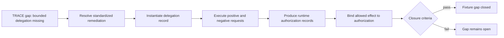
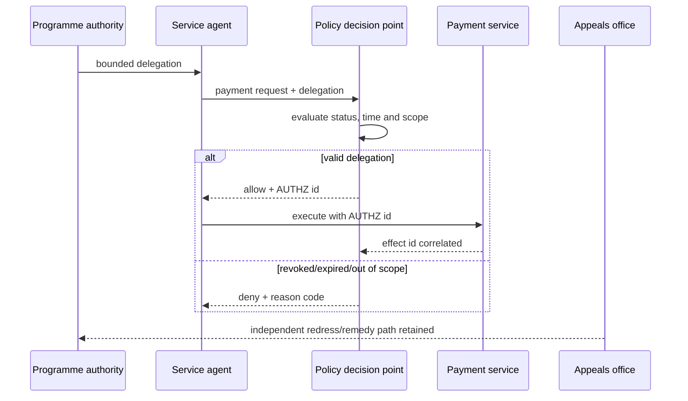

# Delegated entitlement closure fixture

This experimental fixture demonstrates the full operator loop for `CAP-AUTHORITY-BOUNDED-DELEGATION`: identify a governance gap, instantiate standardized remediation, execute failure paths, preserve authorization evidence, and produce evidence sufficient for a TRACE closure decision within the fixture scope.

{: .warning }
This is a jurisdiction-neutral test fixture. Closing the fixture gap does not close any real publication review, confer legal authority, or certify a production deployment.

## End-to-end flow

## Actors and authority

## Fixture artifacts

- `delegation-record.yaml` — instantiated bounded delegation.
- `authorization-requests.yaml` — positive and adversarial requests with expected decisions.
- `runtime-authorization-records.yaml` — preserved decision evidence.
- `closure-evidence.yaml` — control-to-evidence mapping and closure result.

## Closure claim

The fixture claims only that its own acceptance criteria are satisfied:

1. a named accountable authority exists;
2. delegation is bounded by actor, action, resource, purpose and time;
3. revoked, expired and out-of-scope requests fail closed;
4. the allowed payment effect is correlated to its runtime authorization;
5. redress remains discoverable; and
6. the evidence set records the result.

The intended programme consequence is methodological: TRACE can now demonstrate **evidence-backed closure in a realistic synthetic deployment fixture**, while the real-review baseline remains historically unchanged at zero deployment-backed closures.
