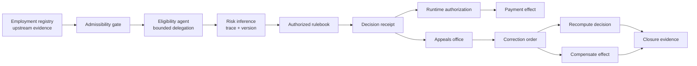
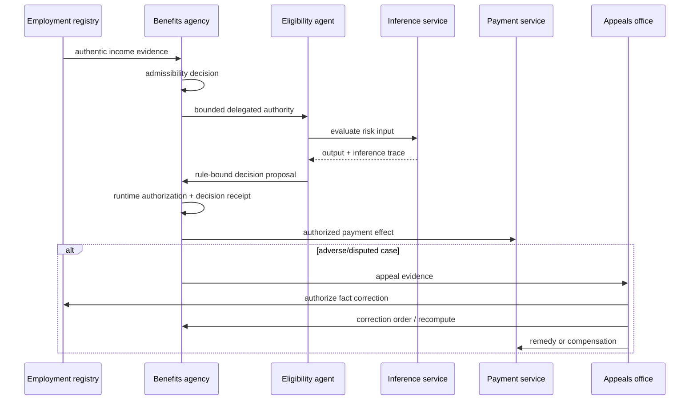

# Digital Statecraft benefit closure

This synthetic, jurisdiction-neutral public-benefit fixture demonstrates the complete improvement loop using all six recurring capability classes found across the first-wave Digital Statecraft corpus.

It does **not** claim that a publication has been fixed, that a production deployment conforms, or that the example policy is legally appropriate.

## Architecture



## Authority and decision sequence



## Capabilities exercised

| Capability | Fixture evidence |
| --- | --- |
| `CAP-AUTHORITY-BOUNDED-DELEGATION` | scoped delegation + authorization + scope/revocation negatives |
| `CAP-INTERINSTITUTIONAL-ADMISSIBILITY` | upstream reliance profile + authentic-but-inadmissible negative |
| `CAP-INFERENCE-TRACEABILITY` | immutable model/version/input/threshold trace + mutation negatives |
| `CAP-REDRESS-APPEAL` | appeals authority + successful disposition + unavailable-redress negative |
| `CAP-CORRECTION-PROPAGATION` | correction order + recomputation/compensation + partial-failure negative |
| `CAP-EVIDENCE-CLOSURE` | effect correlation + capability/acceptance evidence + broken-correlation negative |

## Before and after

The historical Lab baseline against Artifacts registry 0.2.0 recorded **10 of 19** gaps with standardized remediation (52.63%). The artifact development sequence subsequently standardized the three missing recurring capabilities. This fixture then demonstrates that the resulting six-capability package can be instantiated and adversarially exercised together.

The before/after claim is scoped carefully:

```text
historical publication-gap coverage: 52.63%
        ↓
evidence-derived artifact development
        ↓
current first-wave capability mapping: 100%
        ↓
synthetic selected-capability closure: 6/6 pass
```

The publication-level closure rate remains zero because no Digital Statecraft essay is itself a deployment.

## Negative-path evidence

The fixture denies or fails as expected for:

- delegated action outside scope;
- revoked delegation;
- authentic but inadmissible evidence;
- inference model version mismatch;
- decision-relevant threshold mismatch;
- unavailable redress;
- partial mandatory correction propagation;
- broken effect-to-authorization correlation.

Run:

```bash
python tools/validate_digital_statecraft_benefit_closure.py
```

## Evidence files

- [`system-profile.yaml`](system-profile.yaml)
- [`implementation-evidence.yaml`](implementation-evidence.yaml)
- [`adversarial-scenarios.yaml`](adversarial-scenarios.yaml)
- [`closure-evidence.yaml`](closure-evidence.yaml)

## Assurance boundary

The fixture proves only that these repository contracts can be composed and deterministically tested in the declared synthetic scenario. Real deployment closure would require real authority records, implementation evidence, cryptographic integrity, operating logs, affected-person redress tests, and jurisdiction-specific review.
