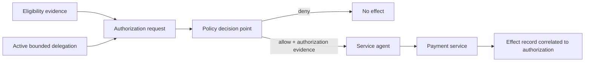

# Executable governance entitlement agent

This case is a compact executable-governance fixture for a public-benefit payment flow. It is designed to answer a specific implementation question:

> When may an automated service agent cause a consequential payment effect, and what evidence proves that the effect was within valid authority?

## What is in this case

- [`governance-model.yaml`](governance-model.yaml) — authority, delegation, actors, actions, decision point, revocation, redress and assurance claims.
- [`scenarios.yaml`](scenarios.yaml) — one positive path and five negative/governance-failure scenarios.
- [`../harm-chain-pressure-tests/delegated-entitlement-agent.yaml`](../harm-chain-pressure-tests/delegated-entitlement-agent.yaml) — operational harm chain showing what can happen when authority enforcement fails.

## System proposition

An automated `service-agent` may initiate a programme payment only when all of the following are true at effect time:

1. the programme authority has delegated the relevant payment action;
2. the delegation is active and within scope;
3. fresh eligibility evidence exists;
4. a runtime authorization decision is bound to the requested effect;
5. the payment executor can correlate the eventual effect to that authorization.



## Authority model

The fixture deliberately separates:

- **eligibility authority** — determines whether programme eligibility conditions are satisfied;
- **payment authority** — governs whether the payment effect may occur;
- **delegated service agent** — may request/execute only the bounded action it has been delegated;
- **runtime authorization authority** — evaluates the effect-time conditions;
- **appeals office** — owns the redress path for adverse or disputed outcomes.

A service identity or credential is **not** sufficient authority to pay.

## Run the governance validator

From the repository root:

```bash
dpi-lab governance-validate case-studies/executable-governance-entitlement-agent
```

To produce and then verify the case manifest in a working copy:

```bash
cp -R case-studies/executable-governance-entitlement-agent /tmp/entitlement-agent-case
dpi-lab governance-manifest /tmp/entitlement-agent-case
dpi-lab governance-validate /tmp/entitlement-agent-case --verify-manifest
```

## Negative paths

The fixture is incomplete if only the happy path succeeds. It requires observable denial/failure behavior for:

| Scenario | Expected behavior |
| --- | --- |
| payment exceeds delegated scope | deny |
| delegation revoked before effect | deny |
| eligibility evidence missing/stale | fail closed |
| effect cannot be correlated to runtime authorization | assurance failure |
| no discoverable appeal/remedy | governance failure |

## Companion Artifacts path

An implementer should resolve the corresponding reusable controls in `dpi-ai-governance-artifacts`, beginning with its implementation recipes and remediation registry.

The primary capability families exercised here are:

- `CAP-AUTHORITY-BOUNDED-DELEGATION`;
- `CAP-EVIDENCE-CLOSURE`;
- `CAP-REDRESS-APPEAL`.

## Minimum evidence before claiming implementation readiness

At minimum preserve:

- accountable authority reference;
- active delegation record with scope/lifecycle/revocation semantics;
- request-time evidence snapshot;
- runtime authorization record;
- payment effect record correlated to the authorization;
- negative-test results for revoked and out-of-scope delegations;
- discoverable redress path and remedy outcome evidence.

## What this case does not claim

This is an experimental reference fixture. It does not create programme authority, establish a lawful payment rule, certify a payment system, or demonstrate production closure.