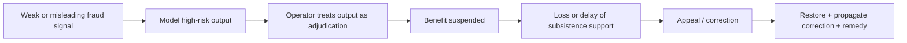
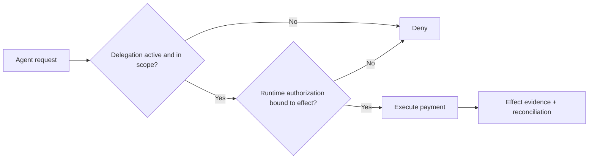

# Harm-chain stabilization pressure tests

This page records the first stabilization exercise for the implementation-first onboarding path and the operational harm-chain contract introduced after Lab `v0.8.0`.

The purpose is deliberately narrow: test whether the same harm model can move two materially different, non-Digital-Statecraft system ideas from **implementation intent → governance mechanism → experienced harm → controls → tests → closure evidence** without changing the schema to fit the examples.

## Cases selected

| Case | Starting point | Primary pressure |
| --- | --- | --- |
| Welfare fraud detection | model-assisted public-service triage | false positives, automation bias, wrongful suspension, delayed remedy |
| Delegated entitlement agent | executable delegated action | scope, revocation, runtime authorization, effect correlation, redress |

The cases differ intentionally. One begins with model-mediated decision risk; the other begins with authority and delegated execution.

## Result

**GO for stabilization.** Both cases fit the existing `schemas/harms/harm-chain.schema.json` without a structural schema change.

The pressure test did expose a documentation gap: the executable entitlement-agent fixture contained useful machine-readable governance and scenario files but no reader-facing README explaining the case, its authority model, how to run it, or how it maps into the implementation-first workflow. That gap is corrected in this tranche.

No new Artifacts capability is justified by these two tests. Their remediation needs resolve to capabilities already represented in the companion repository.

## Pressure test 1 — welfare fraud detection

Source: [`../welfare-fraud-detection.md`](../welfare-fraud-detection.md)

Harm fixture: [`welfare-fraud-detection.yaml`](welfare-fraud-detection.yaml)

### Implementation-first reading

**System proposition:** use an AI-assisted fraud signal to prioritize benefit cases for investigation without allowing the model output to become final suspension authority.

**Consequential decision/effect:** suspension, delay or continuation of a public benefit.

**Authority boundary:** investigative/triage authority and benefit-determination authority must remain distinguishable. A model output is evidence, not authority.

**Primary harm chain:**



**Existing capability pressure:**

- `CAP-INFERENCE-TRACEABILITY`
- `CAP-EVIDENCE-CLOSURE`
- `CAP-REDRESS-APPEAL`
- `CAP-CORRECTION-PROPAGATION`

**Must-fail tests:**

- model output alone attempts to suspend a benefit;
- adverse decision lacks current supporting evidence;
- corrected/reversed decision is not propagated downstream;
- appeal is available only after the harm becomes practically irreversible.

**Minimum evidence:** decision receipt, inference trace, authority reference, appeal/reversal record, correction propagation evidence, aggregate false-positive/reversal signals.

### What the harm model added

The previous case note correctly named false positives, caseworker over-trust and late appeals. The harm-chain contract forces those observations into separate evidence-bearing questions: what triggered the event, which mechanism converted risk into effect, who experienced harm, how it propagated, which signals reveal it, what control prevents/detects/corrects it, and what proves mitigation.

## Pressure test 2 — delegated entitlement agent

Source: [`../executable-governance-entitlement-agent/README.md`](../executable-governance-entitlement-agent/README.md)

Harm fixture: [`delegated-entitlement-agent.yaml`](delegated-entitlement-agent.yaml)

### Implementation-first reading

**System proposition:** allow an automated service agent to initiate a benefit payment only when a valid, bounded delegation and decision-bound runtime authorization exist at effect time.

**Consequential decision/effect:** initiation of a programme payment.

**Authority boundary:** service identity is not payment authority. Authority comes from the programme authority through a bounded delegation plus runtime authorization.



**Existing capability pressure:**

- `CAP-AUTHORITY-BOUNDED-DELEGATION`
- `CAP-EVIDENCE-CLOSURE`
- `CAP-REDRESS-APPEAL`

**Must-fail tests:**

- revoked delegation;
- expired or out-of-scope delegation;
- effect without correlated authorization;
- disputed effect without discoverable redress.

**Minimum evidence:** delegation record, runtime authorization record, effect correlation, revocation result, redress/remedy record.

## Schema stability assessment

| Question | Result |
| --- | --- |
| Can the schema represent model-mediated harm? | Yes |
| Can it represent authority/delegation harm? | Yes |
| Can it distinguish affected parties from system risk? | Yes |
| Can it encode propagation and population effects? | Yes |
| Can it separate preventive/detective/corrective controls? | Yes |
| Can it identify redress and closure evidence? | Yes |
| Did either case require a schema field to be added? | No |
| Did the exercise expose documentation friction? | Yes — case-level implementation guidance |
| Did the exercise justify a new Artifacts capability? | No |

## Adoption-path assessment

The implementation-first path also held across both cases. An implementer can start from the system proposition rather than a publication and derive:

```text
system proposition
  -> consequential decision/effect
  -> affected parties
  -> authority/delegation boundary
  -> harm chain
  -> GAP/CAP pressure
  -> reusable Artifacts recipe
  -> must-fail tests
  -> minimum evidence
  -> TRACE verification
```

The remaining adoption work should therefore emphasize **more reader-facing case guidance and real operator use**, not expansion of the core harm schema merely for completeness.

## Release recommendation

**Recommend Lab `v0.9.0`.**

The new capability is release-worthy because it adds a backward-compatible, machine-verifiable harm-analysis contract and implementation-first adoption path, and both have now been exercised against independent non-corpus cases without structural schema churn.

No companion Artifacts release is required from this pressure test because no Artifacts public contract changed and no new reusable remediation capability was justified.

## Assurance boundary

These are synthetic/reference cases. The successful pressure test demonstrates contract stability and implementation usefulness within the examples; it is not evidence that a real benefit programme, fraud system or delegated agent deployment is safe or certified.
