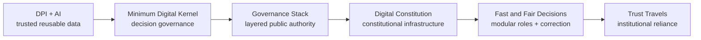

# Digital Statecraft DPI corpus

This corpus is a bounded public demonstration set for the TRACE improvement loop. It contains six Digital Statecraft essays selected because they make substantive propositions about DPI, institutional authority, digital decisions, inter-institutional trust, accountability, or remedy.

## Why these six pieces

The ordering is thematic rather than chronological. Together the pieces span the path from shared digital rails to the institutional and decision machinery needed for accountable use of those rails.

## First-wave corpus

| ID | Piece | Primary evaluation surface |
| --- | --- | --- |
| DS-DPI-001 | A First Principles Case for DPI + AI | DPI + AI composition, trusted data, due process |
| DS-DPI-002 | The Minimum Digital Kernel of an Unbundled State | authority, decision receipts, registries, remedy |
| DS-DPI-003 | The Governance Stack | responsibility across governance layers |
| DS-DPI-004 | The Digital Constitution of the State | recognition, authority, accountability, remedy |
| DS-DPI-005 | Making Fast and Fair Decisions in the Age of AI | modular roles, correction, appeals, audit |
| DS-DPI-006 | How Trust Travels Between Institutions | admissibility, reliance, institutional trust |

## Evaluation boundary

Corpus inclusion is **not** a finding that a post is defective. TRACE asks a narrower operator question:

> If an implementer accepted the proposition, what additional governance detail would be required to build, operate, test, audit, revoke, correct, or redress the resulting system safely?

The canonical publication remains authoritative for its own propositions. The Lab owns only its evaluation method and outputs.

## Reproducibility

- [`corpus.yaml`](corpus.yaml) is the machine-readable frozen manifest.
- [`selection-method.md`](selection-method.md) defines inclusion/exclusion rules.
- Corpus validation runs in CI before later evaluation work can rely on the source set.

The corpus is frozen as `digital-statecraft-dpi-2026-wave1` version `1.0.0`. Any future wave must use a new corpus version rather than silently changing this one.
