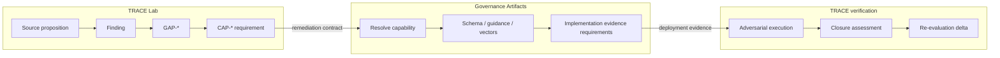
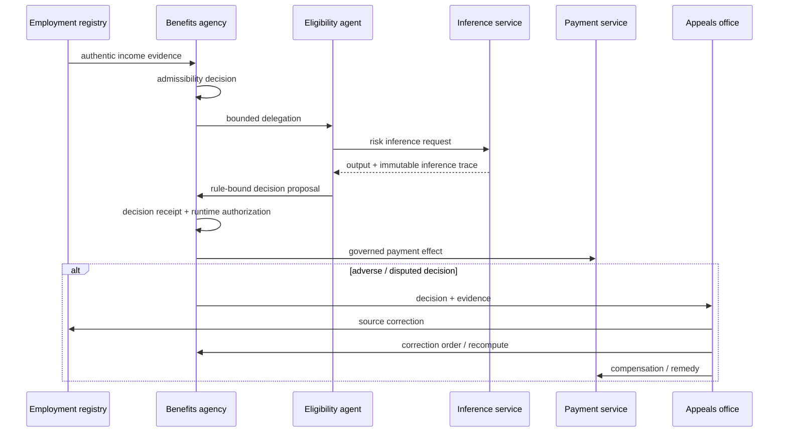
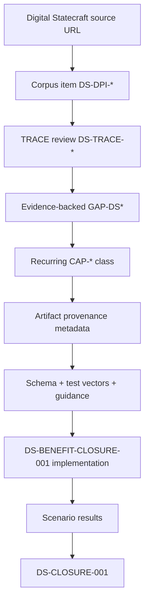

# Digital Statecraft DPI worked demonstration

This worked example shows how the Lab and companion Artifacts repository move from a strong public DPI governance proposition to reusable implementation controls and scoped evidence-backed verification.

The demonstration is **not a grading exercise**. Digital Statecraft remains authoritative for its own essays. TRACE asks what additional enforceable contracts an implementer would need to safely realize the propositions.

## Programme result

| Measure | Evidence-backed result |
| --- | ---: |
| First-wave essays | 6 |
| TRACE reviews | 6 |
| Material implementation-distance gaps | 19 |
| Recurring capability classes | 6 |
| Historical standardized gap mappings | 10 / 19 (52.63%) |
| Historical unmet mappings | 9 / 19 |
| Evidence-derived new reusable capabilities | 3 |
| Current standardized first-wave mappings | 19 / 19 (100%) |
| Worked-fixture selected capabilities | 6 |
| Worked-fixture capability passes | 6 / 6 |
| Executed scenarios | 9 (8 adversarial) |
| Closed publication-level gaps | 0 |

These values are recorded in [`programme-summary.yaml`](../baselines/digital-statecraft-dpi-2026/programme-summary.yaml), with the historical and current Artifacts registry commits preserved separately.

## 1. From publication corpus to evidence

```mermaid
flowchart LR
    A[Digital Statecraft archive] --> B[Frozen 6-post corpus]
    B --> C[6 TRACE reviews]
    C --> D[19 evidence-backed gaps]
    D --> E[6 recurring CAP-* classes]
    E --> F[Historical remediation baseline]
    F --> G[Evidence-derived artifact development]
    G --> H[Worked implementation fixture]
    H --> I[Adversarial tests]
    I --> J[Closure evidence]
```



The corpus was frozen before scoring. That matters: source selection could not be changed after interesting findings appeared.

- [Corpus and selection method](../corpora/digital-statecraft-dpi/README.md)
- [Six TRACE evaluations](../reviews/digital-statecraft-dpi/README.md)
- [Historical corpus baseline](../baselines/digital-statecraft-dpi-2026/README.md)

## 2. What TRACE found repeatedly

The 19 material gaps clustered into only six capability families:

| Capability | Reviews with gap | Historical status |
| --- | ---: | --- |
| `CAP-AUTHORITY-BOUNDED-DELEGATION` | 5/6 | Standardized |
| `CAP-INFERENCE-TRACEABILITY` | 4/6 | None |
| `CAP-CORRECTION-PROPAGATION` | 3/6 | None |
| `CAP-EVIDENCE-CLOSURE` | 3/6 | Standardized |
| `CAP-REDRESS-APPEAL` | 2/6 | Standardized |
| `CAP-INTERINSTITUTIONAL-ADMISSIBILITY` | 2/6 | None |

The historical baseline was evaluated against Artifacts registry `0.2.0` at commit `3ea873bdb2ce719d82c86d459c9699ae6114b0d1`. It remains immutable at **52.63% standardized coverage**.

## 3. Cross-repository responsibility and handoff



The Lab does not become the authority that adopts a control. The Artifacts repository does not acquire deployment authority. The adopting institution retains authority and produces the implementation evidence that TRACE can later assess.

## 4. What the Artifacts programme added

The evidence justified exactly three new recurring capabilities.

### Inference traceability

Four reviews required a durable distinction between an authorized rule and a model, matcher, score or classifier that contributes evidence to the decision.

The Artifacts repository now supplies:

- inference trace schema;
- model/version/input/threshold bindings;
- rule-vs-inference separation tests;
- decision receipt correlation;
- operator guidance and diagrams.

### Correction propagation

Three reviews required correction to travel beyond the source registry into downstream decisions and effects.

The new package adds:

- correction orders;
- dependency targets;
- invalidation/recomputation/replacement/compensation actions;
- execution receipts;
- partial-failure semantics;
- supersession provenance.

### Inter-institutional admissibility

Two reviews distinguished technical authenticity from a receiving institution's right to rely on the evidence.

The new package adds:

- admissibility profiles;
- relying-party decisions;
- purpose/jurisdiction/validity/assurance conditions;
- expiry and revocation semantics;
- authentic-but-inadmissible negative tests.

The current Artifacts registry is `0.5.0` at commit `c4784e7c445ead3c27ca6347201d5d5ff383b95d`. All six recurring first-wave capability classes now have standardized mappings.

## 5. Worked implementation

The [Digital Statecraft benefit closure case](../case-studies/digital-statecraft-benefit-closure/README.md) composes all six capabilities in a public-benefit decision and payment flow.



## 6. Adversarial evidence

The fixture executes nine scenarios. Eight deliberately test failure paths:

- action outside delegated scope;
- revoked delegation;
- authentic but inadmissible evidence;
- model-version mismatch;
- threshold mismatch;
- unavailable redress;
- mandatory correction target failure;
- broken effect-to-authorization correlation.

All expected failure modes are observed deterministically, while the positive path passes.

## 7. Evidence and provenance lineage



This lineage means a maintainer can answer **why an artifact exists**, which reviews demanded it, what tests support its maturity, and what evidence later exercised it.

## 8. Before and after — without rewriting history

```text
Historical baseline (registry 0.2.0)
  10 / 19 standardized mappings = 52.63%
             ↓
Evidence-derived artifact PRs
             ↓
Current registry 0.5.0
  19 / 19 standardized mappings = 100%
             ↓
Synthetic worked fixture
  6 / 6 selected capabilities pass closure criteria
```

These are different assurance statements:

1. **52.63%** records what reusable remediation existed when the corpus baseline was taken.
2. **100%** records current capability-to-remediation mapping after evidence-derived development.
3. **6/6 pass** records the result of the synthetic implementation fixture.
4. **0 publication gaps closed** preserves the fact that essays are not deployments and cannot supply implementation evidence.

## Non-claims

This demonstration does not claim that:

- Digital Statecraft is deficient or has been “fixed”;
- every omitted implementation detail is a governance gap;
- repository artifacts create legal or institutional authority;
- synthetic closure certifies a production deployment;
- the example benefit policy or risk model is a recommended policy design.

The demonstrated claim is narrower and testable: **TRACE can translate recurring operational requirements from a coherent DPI governance corpus into reusable remediation artifacts, exercise those artifacts together, and preserve evidence sufficient to verify scoped closure.**
