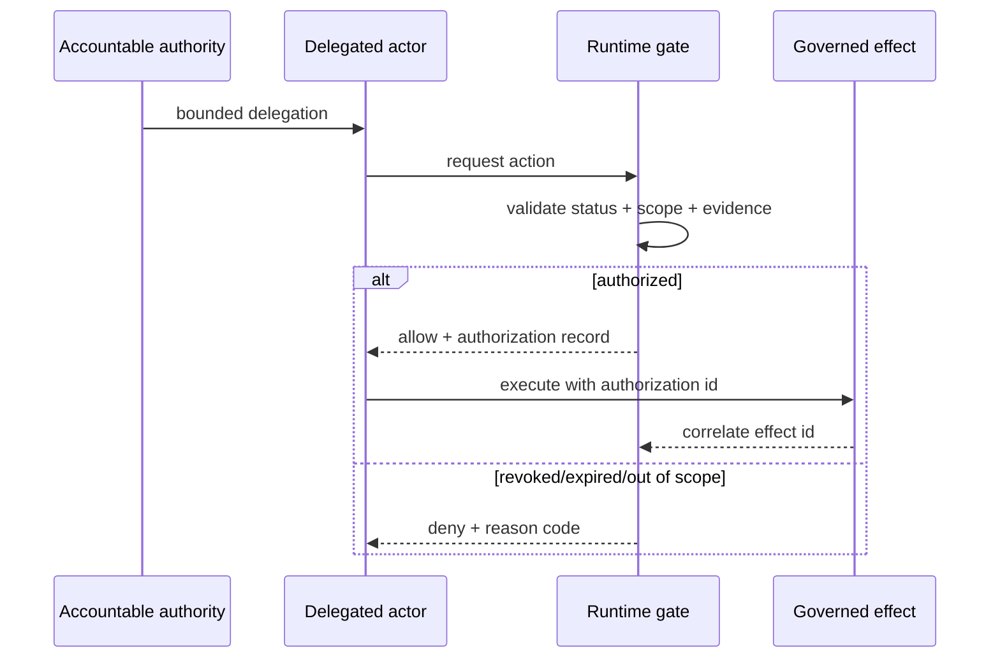

# TRACE Executable Governance Evaluation Preview

TRACE is being extended from deterministic policy-paper review into an experimental executable-governance evaluation capability.

This preview does **not** transfer normative authority from upstream policy, law, specifications, operators, or institutions to the Lab. It provides a repository-owned method for making governance propositions testable and evidence-bearing.

## Evaluation pipeline


## Required evaluation artifacts

An executable-governance evaluation directory contains:

- `governance-model.yaml` — authority, delegation, actions, decision points, evidence, revocation, redress, and assurance claims.
- `scenarios.yaml` — positive and negative vectors with deterministic expected outcomes.
- `evidence-manifest.json` — generated SHA-256 bindings for the validated evaluation inputs.

The evidence manifest is generated rather than hand-authored so validation can detect later mutation of the evaluated inputs.

## Authority discipline

Every governance claim identifies one of three authority classes:

- `upstream` — a proposition attributed to an external authoritative source. TRACE records but does not originate the authority.
- `evaluator` — an analytical or methodological assertion owned by this evaluation.
- `inferred` — an explicit inference that must not be represented as upstream normative content.

Delegation records must reference declared authority. Runtime decision points must reference declared actions and evidence requirements. These checks are structural assurance controls, not legal determinations.

## Required adversarial coverage

Any evaluation containing delegation must include negative vectors covering at least:

- scope violation;
- revocation or expiry;
- missing, stale, or uncorrelated evidence; and
- unavailable or ineffective redress.

The preview deliberately treats a technically valid transaction with no redress path as a governance failure rather than a successful execution.

## Runtime authorization relationship



## CLI

Validate an evaluation:

```bash
dpi-lab governance-validate case-studies/executable-governance-entitlement-agent
```

Generate the evidence manifest:

```bash
dpi-lab governance-manifest case-studies/executable-governance-entitlement-agent
```

Validate the evaluation and verify the generated hashes:

```bash
dpi-lab governance-validate case-studies/executable-governance-entitlement-agent --verify-manifest
```

## Worked cases

`case-studies/executable-governance-entitlement-agent/` models a delegated service agent that may initiate a public-service entitlement payment only after current eligibility evidence, bounded delegated authority, and runtime authorization are all present.

`case-studies/delegated-entitlement-closure/` takes the next step: it instantiates the bounded-delegation remediation package, executes positive and negative authorization requests, preserves runtime authorization records, correlates an allowed effect, and records an evidence-backed closure result within a synthetic fixture scope.

## Portfolio interoperability

| Component | Intended relationship | Authority effect |
| --- | --- | --- |
| TSMM | semantic model mapping | none |
| GAAM | authority/delegation/assurance mapping | none |
| TIS | portable evidence representation | none |
| RAHP | adversarial pressure-testing input | none |
| Trust Protocol Interop Lab | executable cross-system evaluation | none |
| DPI–AI Governance Artifacts | reusable remediation package | none |

Future mappings must state relationship type and normative status explicitly. `maps-to` or `informs` must never be interpreted as `depends-on`, conformance, endorsement, or transfer of authority.

## Preview maturity gate

The capability remains **Experimental** until multiple independently structured worked cases demonstrate deterministic validation, repeatable negative-vector execution, stable schema semantics, evidence-manifest integrity, documented authority boundaries, and no regression to the existing TRACE paper-review workflow.
