# Build from an implementation idea

You do **not** need to begin with a paper review to use the Lab.

Use this path when you have a service, agent, workflow, registry interaction, eligibility rule, AI-assisted decision, or other DPI/AI proposition that you intend to build.

## Choose the right starting path

| You have | Start with | Primary output |
| --- | --- | --- |
| A publication or policy paper | TRACE review workflow | Evidence-backed findings and `governance-gaps.yaml` |
| A service or product concept | This implementation-first path | System proposition + governance gaps |
| An existing deployment problem | Operator playbook | Gap + closure criteria + evidence plan |
| A known `CAP-*` requirement | Companion Artifacts repository | Reusable schemas, tests and guidance |
| A claim that a governance weakness is fixed | Closure verification | Reproducible evidence and re-evaluation |

## The implementation-first loop

```mermaid
flowchart LR
    A[Implementation idea] --> B[System proposition]
    B --> C[Actors + authority + decisions + effects]
    C --> D[TRACE pressure test]
    D --> E[Governance gaps]
    E --> F[Required CAP-* capabilities]
    F --> G[Artifacts resolution]
    G --> H[Implementation + negative tests]
    H --> I[Closure evidence]
    I --> J[TRACE verification]
```



## Step 1 — Write the system proposition

Capture enough structure to make governance testable. At minimum state:

- **purpose** — what outcome the system is intended to produce;
- **affected parties** — who can gain, lose, be delayed, profiled, excluded, or otherwise affected;
- **accountable authority** — who is entitled to make each consequential decision;
- **actors and delegates** — humans, services, agents, models, registries, vendors and operators;
- **inputs** — facts, credentials, registry data, model outputs and policy rules;
- **consequential decisions** — eligibility, prioritization, denial, payment, suspension, referral, enforcement, ranking, etc.;
- **effects** — what actually happens after a decision;
- **revocation/correction paths** — what can invalidate authority, facts, rules or previous outcomes;
- **redress** — who can challenge the decision and who has authority to remedy it;
- **evidence** — what an independent reviewer could inspect later.

A proposition is ready for TRACE pressure testing when these boundaries are explicit enough that a reviewer can ask **what may happen, under whose authority, using which evidence, and how it can be stopped or corrected**.

## Step 2 — Pressure-test governance before implementation

Use TRACE to identify implementation-distance gaps. Typical questions include:

1. Is the accountable authority distinct from the software actor performing the action?
2. Is delegation bounded by actor, action, resource, purpose, time and revocation state?
3. Can authentic upstream evidence still be inadmissible for the downstream use?
4. If a model contributes to a decision, can its exact version, inputs, thresholds and output be reconstructed?
5. Can a decision be explained from versioned rules and evidence rather than from model output alone?
6. Can a person or institution contest the outcome effectively?
7. If a fact is corrected, which downstream decisions and effects must be invalidated, recomputed, replaced or compensated?
8. What negative conditions must fail closed?
9. What evidence would prove that the control operated at decision time?

Material weaknesses become entries in `governance-gaps.yaml`, each with a normalized `required_capability.id` and explicit closure criteria.

## Step 3 — Hand off to the Artifacts repository

The Lab owns the finding and closure question. The companion `dpi-ai-governance-artifacts` repository owns reusable remediation machinery.

The handoff object is:

```text
GAP-*
  required_capability.id: CAP-*
  implementation requirements
  acceptance criteria
  required closure evidence
```

In Artifacts, resolve `CAP-*` through `remediation/remediation-registry.yaml` and instantiate the listed schemas, templates, guidance and test vectors.

## Step 4 — Build the governance controls with the system

Do not treat governance as a documentation phase after engineering. Bind controls to runtime enforcement points.

Examples:

| Governance property | Runtime implementation question | Evidence to preserve |
| --- | --- | --- |
| Bounded delegation | Is this actor authorized for this action/resource/purpose **now**? | delegation + runtime authorization record |
| Admissibility | May this institution rely on this authentic evidence for this decision? | admissibility profile + reliance decision |
| Inference traceability | Which model/version/inputs/thresholds contributed? | inference trace + decision correlation |
| Redress | Can the affected party reach an authority able to change the outcome? | appeal lifecycle + disposition/remedy evidence |
| Correction propagation | Did authoritative correction reach every mandatory dependent target? | correction order + execution receipt |
| Evidence closure | Can an independent reviewer reproduce the control claim? | hashes + manifests + control/evidence mapping |

## Step 5 — Exercise failure paths before claiming readiness

A governance property is not established because the happy path succeeds.

At minimum, select negative tests that can demonstrate failure behavior such as:

- actor or action outside delegated scope;
- revoked/expired authority;
- technically valid but inadmissible evidence;
- stale fact or rule version;
- model/version/threshold mismatch;
- absent decision evidence;
- unavailable redress;
- failed or partial correction propagation;
- effect without correlated authorization.

Record both the expected outcome and the evidence proving that the system enforced it.

## Minimum viable evidence before verification

A team should normally be able to provide:

- system proposition and architecture version;
- accountable-authority map;
- relevant delegation/admissibility/policy records;
- versioned rule and data references;
- runtime decision/authorization evidence;
- selected positive and negative test results;
- redress/correction evidence where consequential outcomes can be challenged;
- evidence manifest with integrity/provenance metadata;
- residual limitations and unresolved risks.

A completed template is **not** closure evidence unless it corresponds to deployed or fixture behavior and its acceptance criteria can be tested.

## Worked proof of method

The [Digital Statecraft DPI worked demonstration](digital-statecraft-dpi-demonstration.md) shows the full loop from propositions to recurring gaps, evidence-derived reusable artifacts, a six-capability implementation fixture, adversarial tests and scoped closure.

It is a proof of the method, not a corpus that adopters are expected to reproduce or exhaust.

## Definition of implementation-ready governance

For this Lab, an idea is implementation-ready when:

1. consequential decisions and effects are explicit;
2. accountable authority and delegation are explicit;
3. material governance gaps have normalized capability requirements;
4. controls have defined runtime enforcement points;
5. negative paths are testable;
6. required closure evidence is known before deployment;
7. residual risks and non-claims remain visible.

That is the point at which governance has become part of the system design rather than an annotation around it.
