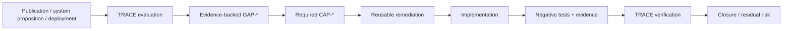

# Start here

The DPI AI Governance Lab is a workbench for turning **publications, system propositions, and deployment weaknesses** into evidence-backed governance findings, normalized gaps, remediation requirements, implementation tests, and closure assessments.

You do not need to begin with a paper review.

## Choose your task

| I need to… | Start here | You should leave with… |
| --- | --- | --- |
| Evaluate a paper or policy publication | TRACE methodology | Reproducible review + governance gaps |
| Turn a service/product idea into a governable design | [Build from an implementation idea](implementation-first.md) | System proposition + `GAP-*` / `CAP-*` requirements |
| Improve an existing DPI/AI deployment | [Operator playbook](operator-playbook.md) | Remediation and closure-evidence plan |
| Understand recurring findings | [Evaluations](evaluations.md) | Comparable evidence and gap patterns |
| Prove that a governance control actually works | [Executable governance](executable-governance.md) | Failure-path tests + closure evidence |
| See a complete end-to-end example | [Digital Statecraft DPI worked demonstration](digital-statecraft-dpi-demonstration.md) | Proposition → gap → artifact → implementation → evidence |

## If you are building something

Use [Build from an implementation idea](implementation-first.md) when you have a service, agent, workflow, registry interaction, eligibility system, AI-assisted decision, or public-sector product concept.

The implementation-first path helps you make explicit:

1. consequential decisions and effects;
2. accountable authorities and delegates;
3. facts, rules, model outputs and other evidence inputs;
4. governance failure paths;
5. normalized `CAP-*` remediation requirements;
6. runtime enforcement points;
7. evidence needed to verify closure.

The companion `dpi-ai-governance-artifacts` repository then supplies reusable schemas, tests and operator guidance for the required capabilities.

## If you are evaluating a publication

Use the deterministic TRACE workflow:

1. read `methodology/README.md`;
2. run `dpi-lab review`;
3. validate with `dpi-lab validate`;
4. encode material findings in `governance-gaps.yaml`;
5. validate and summarize with `dpi-lab gaps-validate --summary`.

A missing implementation detail is not automatically a defect. TRACE distinguishes what the source actually claims from what an implementer would still need to define.

## The improvement loop

## Repository boundary

**Lab owns:** evaluation, evidence extraction, gap normalization, comparison, verification and scoped closure assessment.

**Artifacts owns:** reusable remediation schemas, controlled guidance, test vectors, implementation patterns and evidence requirements.

**Adopting organizations retain:** legal, institutional, programme, procurement and deployment authority.

The Lab can test a governance claim; it does not acquire the authority to make the underlying public or institutional decision.
