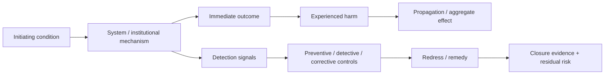

# Operational AI harms

A risk label is not yet an account of harm.

For TRACE, harm analysis should explain **how a condition travels through a technical and institutional system into an experienced adverse outcome, how that harm can be observed, which authority can intervene, and what evidence would prove mitigation or remedy**.

## Risk, governance failure and harm are different

| Concept | Example | Why it matters |
| --- | --- | --- |
| Model risk | classifier has a higher false-negative rate for a subgroup | may exist without a consequential public effect |
| Governance failure | service adopts classifier output without adequate review, traceability or escalation | creates an unsafe decision mechanism |
| Experienced harm | eligible person is denied a benefit and cannot obtain timely remedy | adverse effect borne by an affected party |

TRACE should avoid collapsing these into a single term such as "bias" or "AI risk".

## Harm-chain model

Use `schemas/harms/harm-chain.schema.json` and `templates/harm-chain.example.yaml`.



A useful harm chain records:

1. **initiating condition** — stale facts, poor model performance, invalid delegation, missing admissibility rules, compromised dependencies, misleading synthetic evidence or unsafe policy;
2. **affected parties** — who bears the consequence and what increases exposure;
3. **mechanism** — the technical/institutional path from condition to consequential outcome;
4. **authority failure** — whether authority, delegation, reliance or redress authority is defective;
5. **immediate outcome** — denial, ranking, freeze, referral, payment block, etc.;
6. **experienced harm** — loss, delay, stigma, surveillance exposure, unsafe treatment, coercive burden or inability to correct records;
7. **propagation** — copied records, downstream services, shared registries, feedback loops or population-scale effects;
8. **signals** — evidence that would make the harm observable;
9. **controls** — preventive, detective and corrective mechanisms;
10. **redress/remedy** — who can challenge, who can change the outcome, and what repair is required;
11. **closure evidence** — what proves mitigation, correction or remedy;
12. **residual risk** — harm that remains after the primary control succeeds.

## Operational harm taxonomy

The taxonomy is a pressure-test aid, not an exhaustive legal catalogue.

### Exclusion and wrongful denial

**Mechanisms:** identity mismatch, stale facts, brittle thresholds, inaccessible proof requirements, failed exception handling.

**Signals:** denial clusters, appeal reversals, manual-override rates, unresolved fact corrections.

### Differential error and discriminatory burden

**Mechanisms:** uneven data quality, proxy variables, model error disparities, policy rules that create unequal burdens, feedback loops.

**Signals:** subgroup differences in error, outcome, reversal, delay or proof burden.

A disparity is evidence requiring investigation; TRACE should not infer unlawful discrimination without the relevant legal/institutional analysis.

### Automation bias and institutional de-skilling

**Mechanisms:** operators defer to automated output, meaningful override authority disappears, or disagreement is not recorded.

**Signals:** declining override rates despite uncertainty, missing disagreement records, high reversal rates after appeal.

### Data and provenance harm

**Mechanisms:** stale, misattributed, incomplete or untraceable facts become inputs to consequential decisions.

**Signals:** source/version gaps, correction frequency, unresolved conflicts, decision evidence lacking provenance.

### Privacy, correlation and surveillance expansion

**Mechanisms:** identifiers, behavioral data, model telemetry or agent histories are reused across contexts, enabling linkage or purpose expansion.

**Signals:** purpose drift, unexpected joins, durable cross-context identifiers, access outside declared purpose.

### Authority and delegation abuse

**Mechanisms:** agent/service acts without valid authority, exceeds scope, survives revocation, or obscures the accountable institution.

**Signals:** effects without valid authorization, actions after revocation, scope mismatch, missing authority.

### Institutional accountability diffusion

**Mechanisms:** multiple agencies/vendors/models contribute to an outcome but no actor owns correction or remedy.

**Signals:** circular referrals, unresolved handoffs, remediation without an accountable authority.

### Model and rule drift

**Mechanisms:** model, threshold, policy rule or orchestration logic changes after approval without corresponding governance evidence.

**Signals:** version/digest mismatch, unexplained outcome shifts, deployed artifact differs from approved artifact.

### Manipulation, deception and synthetic evidence

**Mechanisms:** forged documents, synthetic media, prompt manipulation, misleading model output or fabricated evidence influences a consequential decision.

**Signals:** provenance failures, integrity mismatch, contradictory authoritative records, unusual tool/model interactions.

### Security and supply-chain induced harm

**Mechanisms:** compromised dependency, poisoned data, model swap, stolen credentials or malicious tool integration changes decisions/effects.

**Signals:** artifact digest mismatch, unapproved dependency, unexpected privilege use, integrity alerts.

### Correction and remedy propagation failure

**Mechanisms:** source fact is corrected but downstream decisions, payments, flags or derived records remain active.

**Signals:** unresolved mandatory correction target, superseded decision still relied upon, compensation not executed.

### Population-scale and compounding harm

**Mechanisms:** individually small errors repeat across high-volume DPI infrastructure, interact with vulnerability, or reinforce future decisions.

**Signals:** cluster analysis, cumulative exposure, repeated downstream use, long correction latency, feedback-loop indicators.

Single-case accuracy can conceal ecosystem-level harm.

## Detection evidence

Prefer signals that can be reconstructed from versioned evidence, including:

- override, denial, referral and escalation rates;
- complaint and appeal clusters;
- subgroup error/reversal differences;
- correction backlog and propagation failures;
- repeated use of superseded records;
- model/rule/version drift;
- action after authority revocation;
- unusual access/correlation patterns;
- dependency integrity alerts;
- time from incident identification to effective remedy.

## Controls by function

Separate:

- **preventive controls** — constrain authority, evidence, model use or execution before harm;
- **detective controls** — make emerging harm observable;
- **corrective controls** — invalidate, recompute, restore or compensate after failure.

A control may reduce probability without repairing experienced harm. Residual risk remains explicit.

## Redress and remedy

Redress is not merely a contact channel. State:

- who can initiate challenge;
- who has review authority;
- who can change the decision or source fact;
- required timing;
- whether downstream effects must be recomputed;
- what remedy repairs the material consequence as far as adopted policy permits.

## Closure evidence

Before claiming mitigation or closure, identify evidence such as:

- corrected source fact;
- superseding decision receipt;
- restored payment/access/effect;
- correction execution receipt;
- successful negative tests;
- monitoring evidence that propagation stopped;
- effective appeal/remedy evidence;
- residual-risk acceptance by the accountable authority.

## Harm-oriented TRACE adversarial checklist

1. Who can be materially harmed even if the system is technically working as designed?
2. What condition and mechanism produce the adverse outcome?
3. Is the model risk itself the harm, or does an institutional decision create the harm?
4. Which actor has authority at each consequential transition?
5. Can an agent/service act after scope, purpose, time or authority changes?
6. Can technically authentic evidence still be inappropriate for this use?
7. Can stale or corrected facts continue to affect downstream decisions?
8. Can model/rule/version changes be reconstructed later?
9. What harm would remain invisible if only aggregate accuracy were measured?
10. Which groups bear longer delays, higher error rates or higher proof burdens?
11. Is redress reachable and empowered to change the outcome?
12. Does remedy repair propagated effects or only the original record?
13. What evidence would show harm emerging before complaints become the only signal?
14. What negative test demonstrates the preventive control fails closed?
15. What residual harm remains after the primary outcome is corrected?

## Worked example

`templates/harm-chain.example.yaml` models a stale-income record causing wrongful benefit denial and propagation through downstream effects.

```text
stale fact            = initiating condition
unsafe evidence use   = governance/data mechanism
denial                 = system outcome
loss/delay of benefit = experienced harm
repeated stale reuse  = propagated harm
```

That distinction matters: improving model accuracy would not solve this example. Correction propagation, evidence/reliance controls, redress and closure evidence are the relevant surfaces.

## Relationship to remediation capabilities

Harm analysis may identify candidate `CAP-*` capabilities, but it must not force-fit every harm into the current Artifacts registry.

```text
observed harm chain
  → governance / implementation gap
  → normalized required capability
  → check existing remediation coverage
  → reuse / strengthen / create only with evidence
```

This preserves the evidence-derived development discipline of the Lab and companion Artifacts repository.
