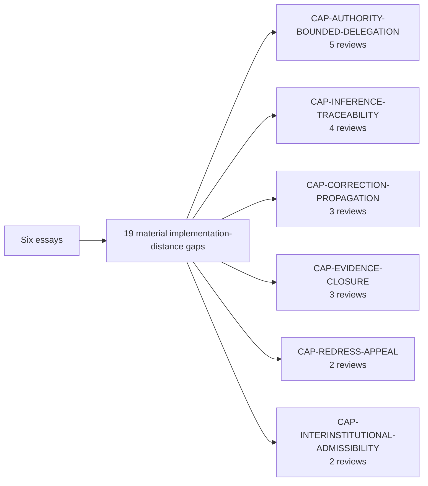

# Digital Statecraft TRACE evaluations

The six frozen first-wave essays have been evaluated under the same TRACE `0.7.0` implementation-distance stance.

## Evaluation question

> If an implementer accepts the proposition, what additional governance detail is required to build, operate, test, audit, revoke, correct, or redress the resulting system safely?

Absence of implementation detail is **not automatically a gap**. A material gap is recorded only where the essay makes an operational proposition whose safe realization requires an additional enforceable contract or evidence surface.

## Corpus result

| Review | Material gaps | Standardized remediation | Unmet capability mappings |
| --- | ---: | ---: | ---: |
| DS-TRACE-001 — First Principles DPI + AI | 3 | 2 | 1 |
| DS-TRACE-002 — Minimum Digital Kernel | 3 | 1 | 2 |
| DS-TRACE-003 — Governance Stack | 3 | 2 | 1 |
| DS-TRACE-004 — Digital Constitution | 3 | 2 | 1 |
| DS-TRACE-005 — Fast and Fair Decisions | 4 | 2 | 2 |
| DS-TRACE-006 — Trust Travels | 3 | 1 | 2 |
| **Total** | **19** | **10** | **9** |

## Recurring capability signal

Three capability families already have standardized remediation in the companion repository: bounded delegation, redress and evidence closure. Three are intentionally left as unmet mappings at this stage: inference traceability, correction propagation and inter-institutional admissibility. The next synthesis stage determines whether adjacent existing assets are sufficient, partial, or require new reusable capability work.

## Evidence and authority boundary

Digital Statecraft remains authoritative for its own publication text. TRACE owns these evaluations and the normalized implementation-distance findings. A publication-level finding is not closed because a reusable artifact exists; closure requires implementation evidence in a declared deployment or fixture scope.
